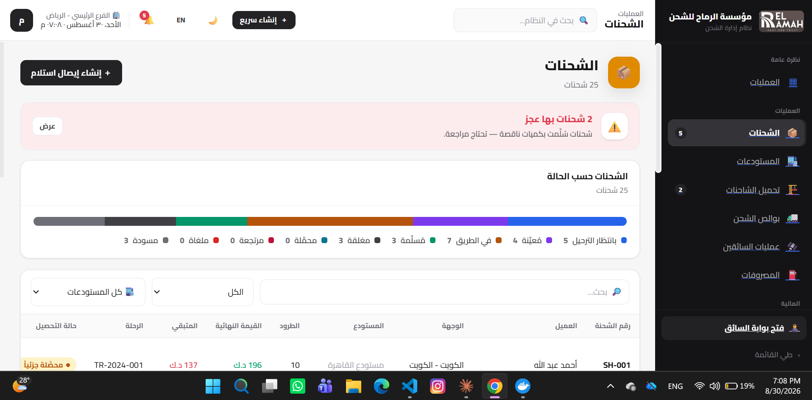

# Shipping Management System

Angular implementation of the El Ramah Shipping Prototype. The prototype is
the source of truth for product identity, navigation, layouts and UX.

Built on Angular 21 · standalone components · Signals · strict TypeScript ·
SCSS design tokens · Arabic/English with runtime RTL/LTR.

**Shipped end-to-end:** containerized with Docker, deployed to Azure App
Service via a GitHub Actions CI/CD pipeline that runs on every push to
`master`.

**Status:** the Azure App Service is live again. It's now running on the Free (F1) tier instead of the original paid B1, a deliberate cost call on a personal Azure for Students subscription. It also landed in a different Azure region than originally planned: the original region returned a zero-quota error for F1, so it now runs in Germany West Central instead (full postmortem in `azure-terraform-practice`). The GitHub Actions deploy secret (`AZURE_WEBAPP_PUBLISH_PROFILE`) was issued for the previous App Service instance, and recreating the App Service generated new deployment credentials, so that secret is now stale and needs refreshing before the pipeline will deploy successfully again. The Docker build and CI/CD logic itself were fully verified working end to end during the internship.



## Engineering problems I diagnosed and fixed

This app hit three real deployment failures on its way to production. Each
one required tracing the actual root cause — not just retrying — using
Azure log tooling (`az webapp log tail`, Kudu container logs) rather than
guesswork.

**1. Express 5 wildcard routing crash**
The static-file catch-all route crashed the server on startup with
`PathError: Missing parameter name at index 2: /*`. Express 5's stricter
path parser dropped support for the bare `/*` wildcard used in Express 4.
Fixed by switching to Express 5's named wildcard syntax, `/*splat`.

**2. Husky's `prepare` script breaking the deployed container**
`npm install` was failing inside the deployed environment. Root cause:
`package.json`'s `"prepare": "husky"` script runs automatically after every
`npm install`, but Husky needs a `.git` directory to register hooks — which
doesn't exist in a deployed application package. Fixed by removing the
`prepare` script from the production path, since git hooks are a
local-dev-only concern.

**3. Missing `node_modules` in production (the real root cause of a 503)**
The live site returned a 503 with `Error: Cannot find module 'express'` in
the logs. Investigated via the full Kudu deployment log and confirmed
`Could not find build manifest file at 'oryx-manifest.toml'` — meaning
Azure's OneDeploy method never triggers Oryx's automatic build step, so
`npm install` never actually ran server-side. Fixed by restructuring the
CI/CD pipeline to run `npm ci --omit=dev` *inside* the deploy package
before it ever reaches Azure, instead of relying on Azure to build it.

## Second CI/CD pipeline: Azure DevOps

This app also deploys through a second, independent pipeline built in Azure
DevOps (Azure Repos + Azure Pipelines), separate from the GitHub Actions
pipeline above.

The normal way to let an Azure DevOps pipeline deploy to Azure is a Service
Connection, and a Service Connection needs an App Registration in Azure AD.
This tenant blocks App Registration creation for non-admin accounts, so that
path was closed before it started. Instead, the pipeline authenticates the
same way Kudu itself does: it publishes straight to the App Service's
ZipDeploy REST endpoint with curl and Basic Auth, using the publish-profile
credential directly rather than going through a Service Connection or a
marketplace deploy task. Same deployment target, no App Registration
required.

The Azure DevOps project is private, so it isn't linked here.

## Quick start

```bash
npm install
npm start          # dev server → http://localhost:4200/portal
npm run lint       # ESLint (includes architecture boundary rules)
npm test           # unit tests (Vitest)
npm run build      # production build
npm run format     # Prettier
```

## Where to go next

| You want to…                | Read                                             |
| --------------------------- | ------------------------------------------------ |
| Understand the architecture | [docs/Architecture.md](docs/Architecture.md)     |
| Migrate a prototype screen  | [docs/MigrationGuide.md](docs/MigrationGuide.md) |
| Start as a new team member  | [docs/Onboarding.md](docs/Onboarding.md)         |
| Know the rules              | [docs/Standards.md](docs/Standards.md)           |
| See why decisions were made | [docs/adr/README.md](docs/adr/README.md)         |
| Team process                | [project-playbook/](project-playbook/)           |

## The one rule

A feature may import from `core`, `shared`, and itself — **never from another
feature**. The linter enforces this; `npm run lint` fails on violations.

## Governance

The architecture is defined by the **Frontend Engineering Charter v1.0**
(see `docs/adr/README.md`). Changes to it go through the Decision Log in
`project-playbook/DecisionLog.md` — not through ad-hoc refactors.